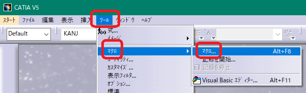
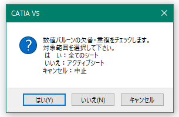
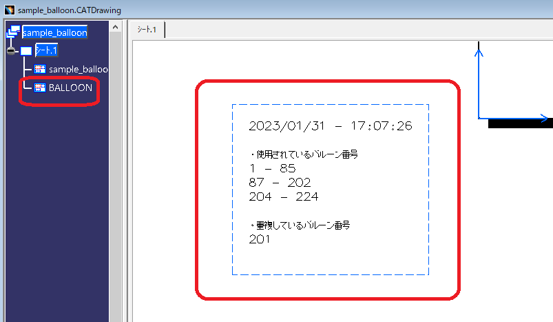

# ***CATIA V5 Numeric Balloon Check***

本マクロはCATIA V5用のVBAマクロです。
番号バルーンの欠番・重複をチェックします。

---

## **インストール**:

zipファイルをダウンロードし展開します。

"Numeric_Balloon_Check.bas" を任意のVBAプロジェクト(catvba)にインポートして下さい。

---

## **使用方法**:

マクロのメニューから起動します。

何度も利用する場合は、ツールバーに登録するか、[こちらのシンプルなメニュー](https://github.com/kantoku-code/CATIA_V5_SimpleMacroMenu) を利用する事をおススメします。

起動後はダイアログが表示されます。任意のボタンを押してください。

+ はい：アクティブなDrawingドキュメントの全てのシートのバルーンが対象です。

+ いいえ：アクティブなシートのバルーンが対象です。

+ キャンセル：マクロを中止します。

---

## **実行結果**:

アクティブなシートに"BALLOON"と言うビューが追加され、シートの原点付近にテキストを作成し処理結果を出力します。

+ 数値のみのバルーンが処理対象です。

+ 過去に実行している場合は、新たなビューやテキストは作成されず、上書きします。

---

## **問題点**:

+ テスト不足。

---

## **条件**:

+ CATIA V5が使用可能な事

---

## **アクション**:

以下の環境で確認済みです。

+ CATIA V5_6 R2018

+ Windows10 64bit Pro

---

## **ライセンス**:

- Apache License 2.0 